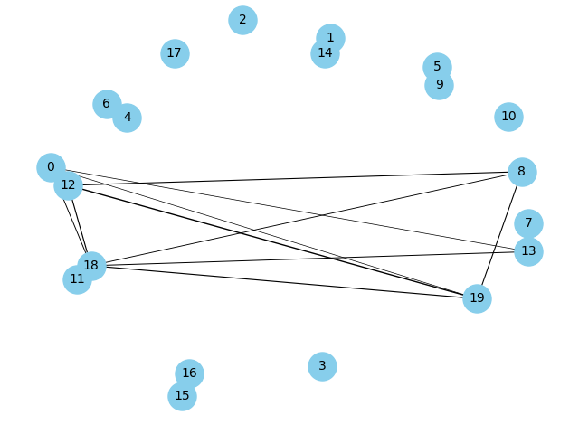
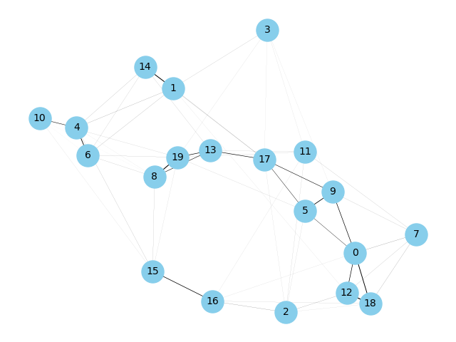
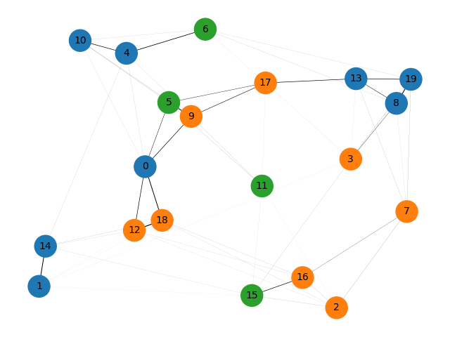
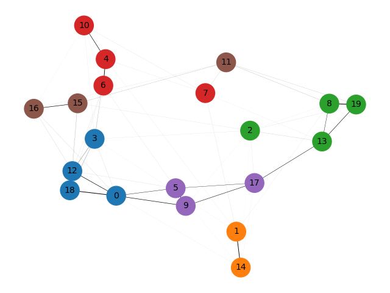
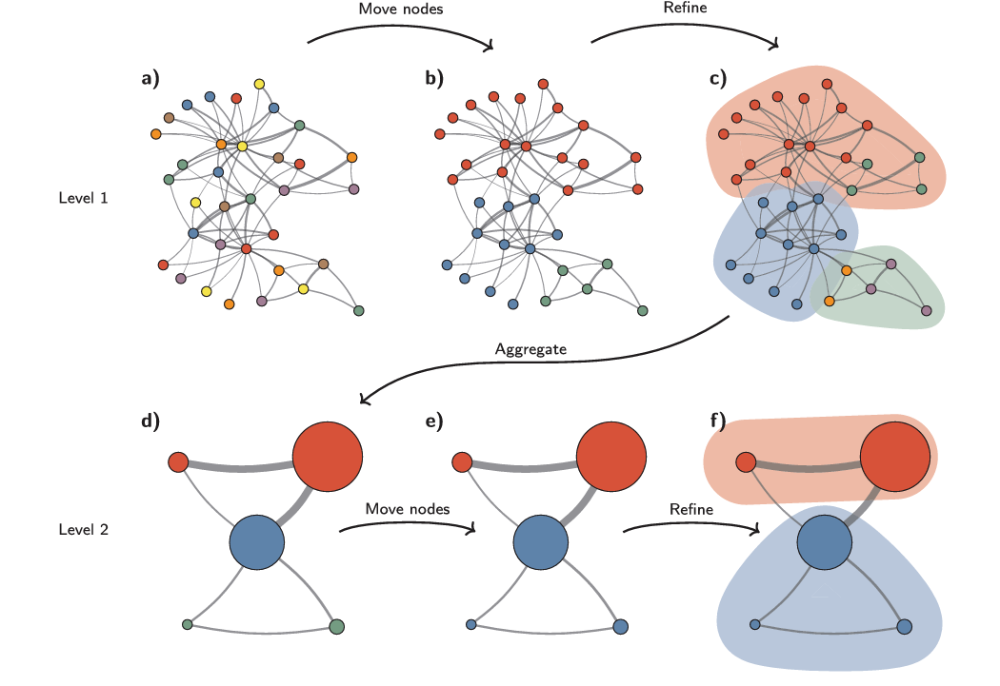
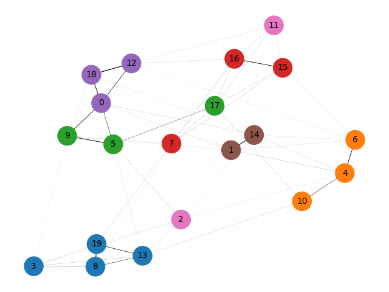
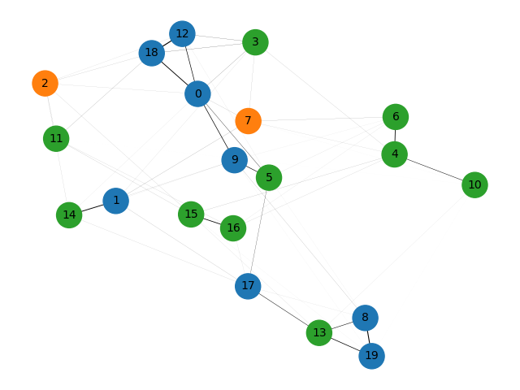

# Community Detection in Feature Decomposition
A feature decomposition task using community detection method.
## Data Preprocessing
### Data Sampling and Feature Generation
we are using 20 random functions(including non-linear functions with 10 variables)   
Each function value is as a feature.
We generate the variables in standard normal distributions.   
The data will be generated by sampling those variables using the func list.
### Graph building
#### Correlation + $\epsilon$
​$$ sim(u,v)=\frac{\sum_{i\in I}(r_{ui}-\bar r_u)(r_{vi}-\bar r_v)}{\sqrt{\sum_{i\in I }(r_{ui}-\bar r_u)^2}\sqrt{\sum_{i\in I }(r_{vi}-\bar r_v)^2}} $$
$$
\begin{equation}
G_{uv} = \left\{
\begin{array}{rcl}
0 & & |sim(u, v)< \epsilon|\\
sim(u, v) & & other\\
\end{array} \right.
\end{equation}
$$
#### Correlation + $K-\tau$ Method
$$
\begin{equation}
G_{uv}= \left\{
\begin{array}{rcl}
0 & & |sim(u, v)|< \tau\ or\ u =v\\
sim(u, v) & & |sim(u, v)| >= \tau\\
\end{array} \right.
\end{equation}
$$
And if $||d_i||$ < $K$, connect $x_i$ to $K$ most correlated samples.
#### simple display
Here are 2 little demos using epsilon = 0.5 and K = 5 & $\tau$ = 0.7.

The epsilon method is easier, but more possible to generate isolated structure/sparse graph.

The K-$\tau$ method is more flexible, while more parameters and more complicated.
#### Graph clustering
We can annotate the graph nodes to get labels for each node.

## Node clustering
Here we consider train embeddings for the node in a graph, the common method is to do sampling for each node sequence as sentence, each node as a word. Then the sentences and the words are trained in a Word2Vec framework.
### Louvain algorithm
1. For each node $i$, the algorithm considers moving it to the community of each of its neighbors $j$ and calculates the gain in modularity from such a move.   
2. If moving node $i$ to the community of node $j$ results in a positive gain in modularity, the move is made.   
3. This process is repeated iteratively for all nodes until no further improvement in modularity can be achieved by moving any single node.

### Leiden algorithm

### DER algorithm

### K-$\tau$ Graph + Node2Vec
Node2Vec is also a sampling + word2vec framework algorithm.   
Unlike simple random walks, Node2Vec uses a biased random walk strategy that balances between breadth-first search (BFS) and depth-first search (DFS).
Two parameters, $p$ and $q$, control this balance:   
$p$: Return parameter that controls the likelihood of immediately revisiting a node in the walk. Higher values encourage exploration away from the starting node.   
$q$: In-out parameter that controls the likelihood of exploring further nodes. Higher values encourage a BFS-like exploration (local neighborhood), while lower values encourage a DFS-like exploration (more global).   
The sampling transition probability is defined as:   
$$
\begin{equation}
\alpha_{pq}(t, x)= \left\{
\begin{array}{rcl}
\frac{1}{p} & & if \ d_{tx} = 0\\
1 & & if \ d_{tx} = 1\\
\frac{1}{q} & & if \ d_{tx} = 2\\
\end{array} \right.
\end{equation}
$$
$t$ is the prev node and $x$ is the possible next node.

## Graph Classification
Here we also consider make embeddings for the whole graph. The base training paradigm is the Doc2Vec model.
### Graph2Vec
k-level subtree extraction as sentences
### Netpro2Vec
the feature is composed of the following 2 parts:
1. the transition probability vectors for each node(generated by random walks)
2. the distance distribute vectors for each node(can be generated by Dj algorithm)
## Clustering Discussion
Clustering is basically unsupervised learning processes, generally the idea is to compute the distances in the high-dimension embedding representations.
### KMeans
### Spectral

